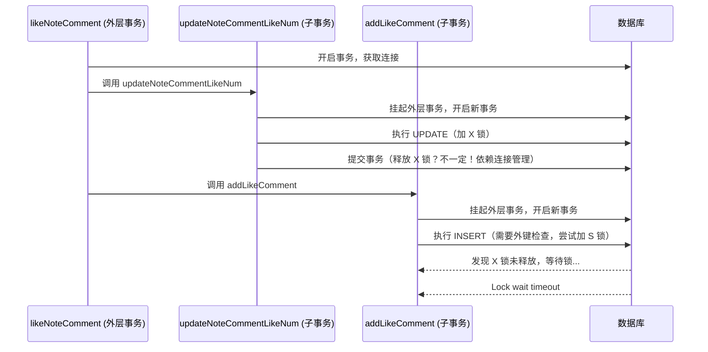
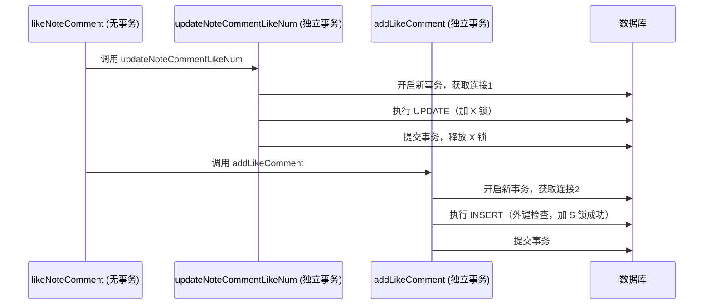
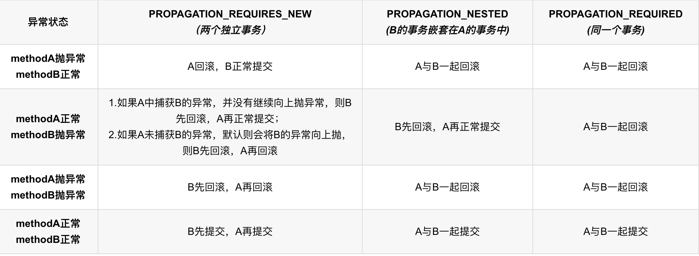

# littleRedBook

在实际开发过程中遇到的问题和实现细节：

1. 使用 MyBatis-Plus 中 `query()` 方法时，需要注意其是否存在多个表字段相同的问题。对于存在多表同名字段的情况，使用 `表名.字段名` 即可解决问题。如下所示：

```java
@Override
public class Result getUserByPhone(String phone) {
    return Result.ok(query().eq("user.phone", phone));
}
```
2. 使用hutool中的 `BeanUtil.beanToMap()`时，需注意转换的 `bean`中的属性不可存在空值,此处有两种处理方法

```java
stringRedisTemplate.opsForHash().putAll(LOGIN_USER_KEY + token, BeanUtil.beanToMap(userDTO, new HashMap<>(), CopyOptions.create().
                setIgnoreNullValue(true).setFieldValueEditor((fieldName, fieldValue) -> fieldValue == null ? null : fieldValue.toString())));
```

或者设置默认如下

```java
public class UserDTO {
    private Long id;
    private String userName = ""; // 默认值
    private String phone = ""; // 默认值
    private String userPassword = ""; // 默认值
}
```

3. 碰到SpringBoot启动类并未加载其配置文件的问题（如设置好了端口但并未使用）。`目前未解决`
4. 碰到了不同模块之间依赖注入无法共用的问题，比如 `CommunityApplication`启动类中调用littleredbook  
模块中的 `StringRedisClient`类，尝试使用了三种不同的注解方式如下所示
```java
@SpringBootApplication(scanBasePackages = "com.example")
@MapperScan("com.example.community.mapper")
```
```java
@SpringBootApplication
@ComponentScan("com.example")
@MapperScan("com.example.community.mapper")
```
```java
@SpringBootApplication(scanBasePackages = "com.example.littleredbook","com.example.community")
@MapperScan("com.example.community.mapper")
```
事实上，以上三种方式均无法解决问题，最终通过在 `CommunityApplication` 启动类中使用 `@Import` 注解引入 `littleredbook` 模块的配置类解决问题
```java
@SpringBootApplication
@MapperScan("com.example.community.mapper")
@Import({com.example.littleredbook.config.RedissonConfig.class, com.example.littleredbook.utils.StringRedisClient.class})
```
5. 使用springcloud时必须指定其相应版本号，并按照所发布的不会冲突的版本号进行依赖导入，最好使用BOM进行版本管理，如下所示，详细可看  
`https://github.com/alibaba/spring-cloud-alibaba/wiki/%E7%89%88%E6%9C%AC%E8%AF%B4%E6%98%8E`
```java
<dependencyManagement>
        <dependencies>
            <dependency>
                <groupId>org.springframework.cloud</groupId>
                <artifactId>spring-cloud-dependencies</artifactId>
                <version>2022.0.0</version>
                <type>pom</type>
                <scope>import</scope>
            </dependency>
            <dependency>
                <groupId>com.alibaba.cloud</groupId>
                <artifactId>spring-cloud-alibaba-dependencies</artifactId>
                <version>2022.0.0.0</version>
                <type>pom</type>
                <scope>import</scope>
            </dependency>
        </dependencies>
    </dependencyManagement>
```  
6.使用MyBatis-Plus时，遇到如下错误:  
`Servlet.service() for servlet [dispatcherServlet] in context with path [] threw exception 
[Request processing failed: org.mybatis.spring.MyBatisSystemException]
with root cause  com.baomidou.mybatisplus.core.exceptions.MybatisPlusException: can not use this method for "getSqlFirst"`
发生在如下代码段
```java
@Override
    public Result getConcernNumByUserId(Integer userId) {
        return Result.ok(baseMapper.selectCount(query().eq("user_id", userId)));
    }
```
经检查发现应该先获取 `query()`对应的 `Wapper()`即修改为如下代码段即可  
```java
@Override
    public Result getConcernNumByUserId(Integer userId) {
        return Result.ok(baseMapper.selectCount(query().getWrapper().eq("user_id", userId)));
    }
```
实际上，在 MyBatis-Plus 中，query() 是 QueryChainWrapper 的入口方法，返回的是 QueryChainWrapper 对象，而非直接可用的 QueryWrapper。  
selectCount 方法需要接收 Wrapper<T> 类型参数（通常为 QueryWrapper），但实际传入的是 QueryChainWrapper。  
MyBatis-Plus 尝试将 QueryChainWrapper 转换为 SQL 时，发现其不包含有效的 getSqlFirst 实现，抛出异常。  
而采用getWrapper() 从 QueryChainWrapper 中提取出真正的 QueryWrapper 实例，即可解决问题。  
7.采用先操作数据库再操作缓存除了防止多线程并发时可能出现的仍写入旧数据的情况外，还可以确保存入缓存的数据中`ID`一定非空。
具体情况如下代码所示
```java
public Result addConcern(Concern concern) {
        if (!save(concern)) {
            return Result.fail("添加新的关注记录失败");
        }
        hashRedisClient.hMultiSet(CACHE_CONCERN_KEY + concern.getId(), concern);
        return Result.ok();
    }
```
假设此时我们采用先存入缓存再写入数据库的情况，那么当concern的`Id`为数据库中的自增字段，那么从前端获取的concern数据中的id
大概率为空，此时会产生空调用报错，并且写入缓存的数据也为空，从而造成隐患。
  
8.在MySQL中使用datetime类型时，需要注意时区的问题，如果计算从数据库中取得的时间和当前系统时间的字符串形式相同的情况下，相差接近
8个小时时，可能是时区不一致导致的问题。可以通过 `application.properties/yml`调整连接数据库的时区设置或者调整spring处理前端返回
数据时的时区设置如下所示:
```java
spring.datasource.url=jdbc:mysql://localhost:3306/little_red_book?serverTimezone=Asia/Shanghai
spring.jackson.time-zone=Asia/Shanghai
```
  
9.关于点赞的理解，方便起见为每个存在点赞数统计的实体类均增加了like_num字段及属性，在使用redis缓存时，为了确保点赞业务的一致性。
需要采用远程调用的方式确保相关点赞记录表和点赞数的同时增加。但针对通过redis缓存操作而言，由于点赞/取消点赞都是需要同时给出 `用户ID`
和 `点赞数据的ID`（如点赞评论所需的评论ID、点赞笔记所需的笔记ID）。  
由于先前的缓存只针对了点赞记录本身的ID进行缓存，因此在查询时我们并
不能通过Redis来优化该查询操作，因此如果存在需求（高并发）应用Redis进行优化的话，我们需要设计二级索引，即除了存入以键值对为<id,likeRecord>
Hash结构数据外，增加键值对<点赞数据ID + 用户ID, ID>来帮助我们优化该查询。  
在源代码的基础上，添加方法和删除方法中均增加对于该索引的存储/删除，此外对于删除而言，前端传入的数据为相应的ID，那么我们无法通过其删除索引结构，此时存在
两种方法。
```java
    @Override
    @Transactional
    public Result removeLikeNote(Integer id) {
        if (!removeById(id)) {
            return Result.fail("删除点赞笔记记录" + id + "失败");
        }
        hashRedisClient.delete(CACHE_LIKENOTE_KEY + id);
        return Result.ok();
    }
```
① 修改传入的数据为likeRecord整体如下所示
```java
    @Override
    @Transactional
    public Result removeLikeNote(LikeNote likeNote) {
        Integer id = likeNote.getId(id);
        if (!removeById(id) {
            return Result.fail("删除点赞笔记记录" + id + "失败");
        }
        hashRedisClient.delete(CACHE_LIKENOTE_KEY + id);
        hashRedisClient.delete(CACHE_LIKENOTE_NOTE_USER_KEY + likenote.getNoteId() + ":" + likenote.getUserId());
        return Result.ok();
    }
```
② 通过传入的id再次查询获取likeRecord如下所示
```java
    @Override
    @Transactional
    public Result removeLikeNote(Integer id) {
        LikeNote likeNote = (LikeNote) this.getLikeNoteById(id).getData();
        if (!removeById(id)) {
            return Result.fail("删除点赞笔记记录" + id + "失败");
        }
        hashRedisClient.delete(CACHE_LIKENOTE_KEY + id);
        hashRedisClient.delete(CACHE_LIKENOTE_NOTE_USER_KEY + likeNote.getNoteId() + ":" + likeNote.getUserId());
        return Result.ok();
    }
```
此次采用第一种方式，主要原因在于第二种方式虽然无需改动其他层的代码整体改动小，但会造成需要维护的。或许会好奇这种方式会增加一次查询，是否会导致性能下降/数据库访问压力过大。
但根据我们的实际应用场景而言，取消点赞操作场景频率通常较低，属于完全可接受的范畴。
  
10.事务嵌套+远程调用+缓存操作导致长事务阻塞问题，进而引发数据库锁未释放造成超时连接。在Spring 事务管理机制下，事务的传播行为和锁持有时间是导致该问题的核心原因。  
我们先看源代码如下所示：
```java
    @Override
    @Transactional
    public Result likeNoteComment(NoteComment noteComment, Integer userId) {
        Object likeCommentData =  messagesClient.getLikeCommentByCommentIdAndUserId(
                noteComment.getId(), userId).getData();
        LikeComment likeComment = BeanUtil.mapToBean((Map<?, ?>) likeCommentData, LikeComment.class, true);
        boolean isLike = likeComment.getId() != null;
        updateNoteCommentLikeNum(noteComment.getId(), isLike);
        if (isLike) {
            messagesClient.removeLikeComment(likeComment.getId());
            hashRedisClient.hIncrement(CACHE_COMMENT_KEY + noteComment.getId(), "likeNum", -1);
            hashRedisClient.expire(CACHE_COMMENT_KEY + noteComment.getId(), CACHE_COMMENT_TTL, TimeUnit.MINUTES);
            return Result.ok();
        }
        likeComment.setCommentId(noteComment.getId());
        likeComment.setUserId(userId);
        messagesClient.addLikeComment(likeComment);
        hashRedisClient.hIncrement(CACHE_COMMENT_KEY + noteComment.getId(), "likeNum", 1);
        hashRedisClient.expire(CACHE_COMMENT_KEY + noteComment.getId(), CACHE_COMMENT_TTL, TimeUnit.MINUTES);
        return Result.ok();
    }
    
    @Transactional(propagation = Propagation.REQUIRES_NEW)
    public void updateNoteCommentLikeNum(Integer commentId, boolean isLike) {
        String sql = isLike ? "like_num = like_num - 1" : "like_num = like_num + 1";
        if (!update(new LambdaUpdateWrapper<NoteComment>()
        .eq(NoteComment::getId, commentId)
        .setSql(sql))) {
        throw new RuntimeException("更新评论点赞数失败");
        }
    }

    // 实际上是messagesClient中的远程调用方法
    @Override
    @Transactional(propagation = Propagation.REQUIRES_NEW)
    public Result addLikeComment(LikeComment likeComment) {
        likeComment.setLikeTime(new Timestamp(System.currentTimeMillis()));
        if (!this.save(likeComment)) {
        throw new RuntimeException("添加新的点赞评论记录失败");
        }
        hashRedisClient.hMultiSet(CACHE_LIKECOMMENT_KEY + likeComment.getId(), likeComment);
        hashRedisClient.expire(CACHE_LIKECOMMENT_KEY + likeComment.getId(), CACHE_LIKECOMMENT_TTL, TimeUnit.MINUTES);
        hashRedisClient.hSet(CACHE_LIKECOMMENT_COMMENT_USER_KEY + likeComment.getCommentId() + ":" + likeComment.getUserId()
        ,"id", likeComment.getId(), CACHE_LIKECOMMENT_COMMENT_USER_TTL, TimeUnit.MINUTES);
        return Result.ok();
    }
```
在上述代码中，当外层方法 likeNoteComment 被 @Transactional 注解包裹时，整个方法会在 一个数据库连接 中运行。即使内部方法（如 updateNoteCommentLikeNum）使用 REQUIRES_NEW，Spring 会通过以下方式管理事务：
- 外层事务（likeNoteComment）会先获取并持有数据库连接。
- 内部事务（REQUIRES_NEW）会暂时挂起外层事务，开启新事务，但底层仍可能复用同一个数据库连接池中的连接。
如果内部事务操作涉及同一行数据（如更新 note_comment 表），外层事务未提交时，行锁可能未完全释放，导致后续操作等待。

假设 updateNoteCommentLikeNum 更新了 note_comment 表的某一行，该行的排他锁（X Lock） 会在外层事务提交后才释放。如果外层事务后续还调用了远程服务或其他耗时操作（如 messagesClient.addLikeComment），锁会长时间持有。  

因此我们可以知道，具体原因在于 `外层事务未提交时，行锁可能未完全释放，导致后续操作等待。`所以我们的解决方案很简单，去除外层事务即可。
```java
    @Override
    public Result likeNoteComment(NoteComment noteComment, Integer userId) {
        Object likeCommentData =  messagesClient.getLikeCommentByCommentIdAndUserId(
                noteComment.getId(), userId).getData();
        LikeComment likeComment = BeanUtil.mapToBean((Map<?, ?>) likeCommentData, LikeComment.class, true);
        boolean isLike = likeComment.getId() != null;
        INoteCommentService noteCommentService = (INoteCommentService) AopContext.currentProxy();
        noteCommentService.updateNoteCommentLikeNum(noteComment.getId(), isLike);
        if (isLike) {
            messagesClient.removeLikeComment(likeComment.getId());
            hashRedisClient.hIncrement(CACHE_COMMENT_KEY + noteComment.getId(), "likeNum", -1);
            hashRedisClient.expire(CACHE_COMMENT_KEY + noteComment.getId(), CACHE_COMMENT_TTL, TimeUnit.MINUTES);
            return Result.ok();
        }
        likeComment.setCommentId(noteComment.getId());
        likeComment.setUserId(userId);
        messagesClient.addLikeComment(likeComment);
        hashRedisClient.hIncrement(CACHE_COMMENT_KEY + noteComment.getId(), "likeNum", 1);
        hashRedisClient.expire(CACHE_COMMENT_KEY + noteComment.getId(), CACHE_COMMENT_TTL, TimeUnit.MINUTES);
        return Result.ok();
    }
    
    @Override
    @Transactional(propagation = Propagation.REQUIRES_NEW)
    public void updateNoteCommentLikeNum(Integer commentId, boolean isLike) {
        String sql = isLike ? "like_num = like_num - 1" : "like_num = like_num + 1";
        if (!update(new LambdaUpdateWrapper<NoteComment>()
        .eq(NoteComment::getId, commentId)
        .setSql(sql))) {
        throw new RuntimeException("更新评论点赞数失败");
        }
    }

    // 实际上是messagesClient中的远程调用方法
    @Override
    @Transactional(propagation = Propagation.REQUIRES_NEW)
    public Result addLikeComment(LikeComment likeComment) {
        likeComment.setLikeTime(new Timestamp(System.currentTimeMillis()));
        if (!this.save(likeComment)) {
        throw new RuntimeException("添加新的点赞评论记录失败");
        }
        hashRedisClient.hMultiSet(CACHE_LIKECOMMENT_KEY + likeComment.getId(), likeComment);
        hashRedisClient.expire(CACHE_LIKECOMMENT_KEY + likeComment.getId(), CACHE_LIKECOMMENT_TTL, TimeUnit.MINUTES);
        hashRedisClient.hSet(CACHE_LIKECOMMENT_COMMENT_USER_KEY + likeComment.getCommentId() + ":" + likeComment.getUserId()
        ,"id", likeComment.getId(), CACHE_LIKECOMMENT_COMMENT_USER_TTL, TimeUnit.MINUTES);
        return Result.ok();
    }
```
移除外层事务注解后：
- 每个内部方法（如 updateNoteCommentLikeNum）的 REQUIRES_NEW 会直接开启独立事务，使用独立的数据库连接。
- 更新和插入操作的事务完全独立，锁在子事务提交后立即释放，不再受外层事务影响。

updateNoteCommentLikeNum 的 REQUIRES_NEW 事务会在方法结束时提交，锁立即释放。后续的 addLikeComment 插入操作（尤其是涉及外键检查时）无需等待锁，避免超时。


此外，我们也能注意到，移除外层事务后，即使子方法使用默认的 REQUIRED，由于外层无事务，每次调用子方法都会新建独立事务，本质上与 REQUIRES_NEW 的效果一致。哪怕另外两个事务采用默认事务传播机制一样不会发送死锁的情况。  

综上所述，我们可以把解决方法具体归类于以下内容。

1. **避免跨操作的长事务(重要)**  
   移除外层事务注解（`@Transactional`），确保每个数据库操作在独立事务中快速提交，避免长事务持有锁。
2. **为子方法显式指定独立事务**  
对关键操作（如更新和插入）使用 `REQUIRES_NEW` 传播级别，强制开启新事务：
   ```java
   @Transactional(propagation = Propagation.REQUIRES_NEW)
   public void updateNoteCommentLikeNum(...) { ... }
3. **优化外键索引**
  
    确保 like_comment 表的 comment_id 字段有索引，加速外键约束检查。
4. **异步化非核心操作(可选)**  
将 Redis 缓存操作移到事务外，或通过异步线程执行，减少事务耗时：
    ```java
    public Result likeNoteComment(...) {
    // 同步执行数据库操作
    updateNoteCommentLikeNum(...);
    messagesClient.addLikeComment(...);
    
        // 异步更新 Redis
        CompletableFuture.runAsync(() -> {
            hashRedisClient.hIncrement(...);
            hashRedisClient.expire(...);
        });
        return Result.ok();
    }
    ```
5. **避免跨服务事务(可选)**  
   若涉及远程调用（如 Feign 调用），改用消息队列实现最终一致性
    ```java
    // 发送事务消息到 RocketMQ
    rocketMQTemplate.sendMessageInTransaction(
        "like-comment-topic",  // 消息主题
        MessageBuilder.withPayload(likeComment).build(),  // 消息内容
        null  // 业务参数
    );
    
    // 消费者端事务监听
    @RocketMQTransactionListener
    public class LikeCommentListener {
        @Transactional(propagation = Propagation.REQUIRES_NEW)
        public boolean execute(Message msg) {
            LikeComment likeComment = parsePayload(msg);
            // 执行插入操作
            return this.save(likeComment);
        }
    }
    ```

11. 确保点赞业务一致性的方法，可以通过判断当前点赞记录的创建时间和上一次刷新时间，每隔30min通过查询数据库SQL语句确保点赞数的一致性（最好使用事务确保刷新时一致性），下面是可能的代码实现：
```java
    @Override
    public void refreshLikeNum() {
        List<LikeNote> likeNotes = list();
        for (LikeNote likeNote : likeNotes) {
            if (likeNote.getCreateTime().getTime() - likeNote.getRefreshTime().getTime() > 30 * 60 * 1000) {
                Integer likeNum = baseMapper.selectCount(query().eq("note_id", likeNote.getNoteId()));
                hashRedisClient.hSet(CACHE_LIKENOTE_KEY + likeNote.getId(), "likeNum", likeNum);
                hashRedisClient.expire(CACHE_LIKENOTE_KEY + likeNote.getId(), CACHE_LIKENOTE_TTL, TimeUnit.MINUTES);
                likeNote.setRefreshTime(new Timestamp(System.currentTimeMillis()));
                updateById(likeNote);
            }
        }
    }
```
