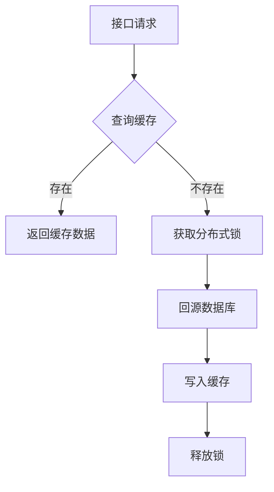

# LittleRedBook 简版 Web 端 Java 实现

## 项目概述
LittleRedBook 是一个简版的小红书 Web 端应用，旨在提供一个类似小红书的笔记分享和互动平台。用户可以发布笔记、评论、点赞、收藏等内容，并与其他用户进行互动。

## 核心功能模块
### 1. 用户服务
- **注册登录**：JWT令牌验证、短信验证码
- **信息管理**：用户资料查询/修改、粉丝关系管理
- **安全控制**：权限拦截、会话管理

### 2. 笔记服务
- **内容发布**：多类型（图文/视频）笔记创建（含文件上传）
- **内容检索**：多维度查询（ID/用户/标签/标题）
- **热度排序**：基于点赞量/收藏量/时间的动态排序
- **互动管理**：评论/回复的嵌套结构、敏感词过滤

### 3. 社交服务
- **点赞系统**：笔记/评论/回复的原子化点赞（Redis计数器+DB异步持久化）
- **收藏系统**：二级缓存架构（用户维度列表缓存+单条记录缓存）
- **关注系统**：双向关注关系维护、粉丝列表缓存

### 4. 消息服务
- **通知中心**：点赞/评论/关注实时消息推送
- **消息管理**：10分钟撤回机制、批量删除
- **会话管理**：用户私信对话缓存（Redis SortedSet）

### 5. 记录服务
- **浏览历史**：LRU策略缓存最近50条记录
- **搜索历史**：自动补全、高频词统计

### 6. 网关服务
- **API网关**：Spring Cloud Gateway实现路由转发
- **服务注册**：Eureka服务注册与发现
- **熔断器**：Hystrix实现服务降级
- **限流器**：Redis实现接口限流
- **负载均衡**：Ribbon实现客户端负载均衡
- **API文档**：Swagger UI实现接口文档自动生成

## 技术栈
- **后端开发**：Java 17
- **框架**：Spring Boot 3.0.2, Spring Cloud 2022.0.0
- **数据库**：MySQL 8.0.33
- **缓存**：Redis 6.2.6
- **分布式锁**：Redisson 3.13.6
- **ORM**：MyBatis-Plus 3.5.7
- **工具库**：Hutool 5.7.17
- **开发工具**：IDEA 2023.1.7
- **构建工具**：Maven 4.0.0
- **消息队列**：RabbitMQ 3.11.12

## 技术架构
### 分层设计
| 层级        | 技术组件                     |
|-----------|--------------------------|
| 网关层       | Spring Cloud Gateway     |
| 业务层       | Spring Boot 3.0          | 
| 数据访问层     | MyBatis-Plus 3.5.7       |
| 缓存层       | Redis 6.2 + Redisson 3.13 |
| 基础设施      | MySQL 8.0 + MinIO        |

### 缓存策略

## 模块划分
1. **userCenter**：用户中心模块，负责用户相关的所有功能。
2. **notes**：笔记模块，负责笔记的发布、查询、评论、点赞等功能。
3. **messages**：消息模块，负责站内消息的发送和管理。
4. **community**：社区模块，负责用户关注、浏览记录等功能。
5. **search**：搜索模块，负责用户的搜索记录管理。
6. **littleredbook**：公共模块，包含工具类、配置类等。

## 部署步骤
1. **克隆项目**
   bash git clone https://github.com/your-repo/LittleRedBook.git cd LittleRedBook
2. **配置数据库**
   修改 `src/main/resources/application.properties` 中的数据库连接配置。
3. **启动服务**
   bash mvn spring-boot:run
4. **访问应用**
      打开浏览器访问 `http://localhost:8080`。

## 贡献
欢迎任何形式的贡献，包括但不限于代码提交、文档改进、问题反馈等。请参考 [CONTRIBUTING.md](CONTRIBUTING.md) 获取更多信息。

## 许可证
本项目采用 [MIT 许可证](LICENSE)。
